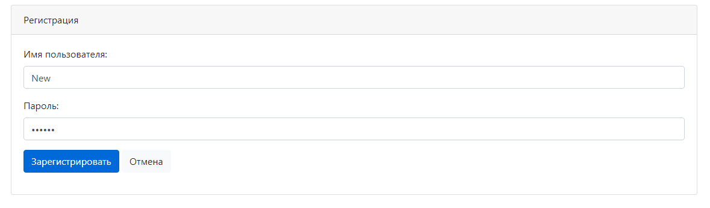
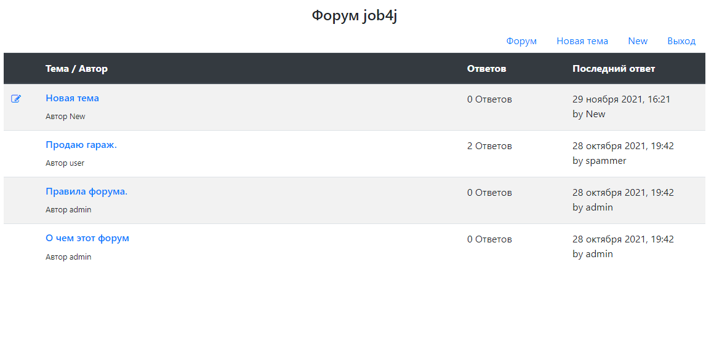

# job4j_forum

+ [О проекте](#О-проекте)
+ [Технологии](#Технологии)
+ [Использование](#Использование)
+ [Контакты](#Контакты)

## О проекте

Веб-приложение реализует функционал закрытого форума. Есть возможность создавать темы, а также оставлять в них 
комментарии различным пользователям. Просматривать темы форума могут только зарегистрированные пользователи. Имеется 
функционал регистрации новых пользователей. В данном проекте используется фреймворк Spring. Приложение развернуто в 
облаке в сервисе [Heroku](https://morning-reef-32109.herokuapp.com/).

## Технологии

+ Сборщик проектов **Maven**;
+ Frontend - **HTML**, **CSS**, **BOOTSTRAP**;
+ Backend - **Java 14**, **Spring Boot**, **JSP**, **Liquibase**;
+ Тесты - **Junit**, **H2**, **Mockito**;
+ Облачная платформа - **Heroku**;
+ Логгирование - **Log4j**, **Slf4j**;
+ СУБД - **PostgreSQL**;
+ Непрерывная интеграция - **Travis CI**;
+ Инструмент для анализа стиля кода - **Checkstyle**;

## Использование

Первое, что видит любой неавторизованный пользователь, это окно авторизации:

Для того чтобы пользоваться форумом, необходимо зарегистрироваться.

---

Перейдем на страницу регистрации:

Заполним необходимые поля и создадим нового пользователя:

---

После авторизации на форуме, мы попадём на основную страницу форума со всеми его темами:

Сверху находится навигационное меню, где имеются кнопки: переход (обновление) на основную страницу форума, создание 
новой темы и выход из-под текущего пользователя. Мы можем просматривать любые темы и оставлять в них комментарии.

---

Создадим новую тему:

После сохранения нас перебрасывает в неё:

---

Вернёмся на основную страницу и убедимся, что новая тема присутствует на форуме, а также то, что она находится в самом 
верху:

Также видно, что автор темы может отредактировать свою тему. Рядом с темой находится соответствующая кликабельная 
иконка.

---

Давайте перейдем во вторую тему и оставим какой-нибудь комментарий:

После отправки:

Также перейдем на главную страницу и увидим изменение в колонках "Количество ответов" и "Последний ответ":

## Контакты

Становов Семён Сергеевич

Email: sestanovov@gmail.com

Telegram: [@stanovovss](https://t.me/stanovovss)